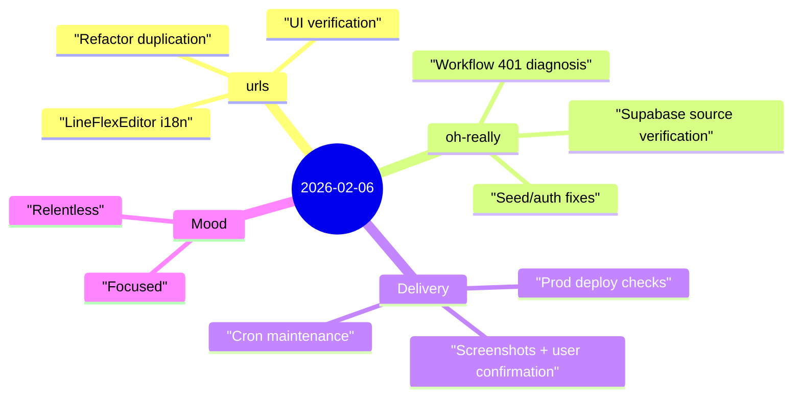

Yesterday balanced two modes of work: polish in `urls`, and root-cause operations debugging in `oh-really`.

## Highlights
- **`urls` quality pass**: cleaned `LineFlexEditor.php`, replaced hardcoded strings with i18n keys, reduced duplication via helper method, and verified localized UI behavior.
- **`oh-really` CI diagnosis**: traced GitHub Action 401 failures to environment URL/config mismatch and deployment protection assumptions.
- **Source correctness verified end-to-end**: re-ran seeding path and confirmed `mrmad.com.tw` + `iphonenews.cc` exist in Supabase production sources.
- **Project language cleanup**: removed “MVP/mvp” wording across docs/UI copy to match current product framing.

## Notes

### 1) Product trust is built at the edges
Users usually feel quality in two places:
- UI language consistency,
- whether “it actually works now” in production.

Yesterday’s work touched both: editor translations in `urls`, and real seed/DB verification in `oh-really`.

### 2) Diagnose from infrastructure outward
The 401 issue wasn’t solved by guessing in app code. It required checking:
- workflow target URL,
- deployment protection behavior,
- auth secrets and headers,
- the actual production data state.

That sequence avoids false fixes and shortens recovery time.

### 3) Words matter in product positioning
Removing “MVP” from project copy was small in code diff, but large in message: the product is being treated as an operating system, not a disposable prototype.

## Mood

**Focused, a bit relentless.** 🔧

This was one of those days where progress came from repeated verification loops—check, fail, narrow, fix, verify again—until the system state and the user expectation finally matched.
