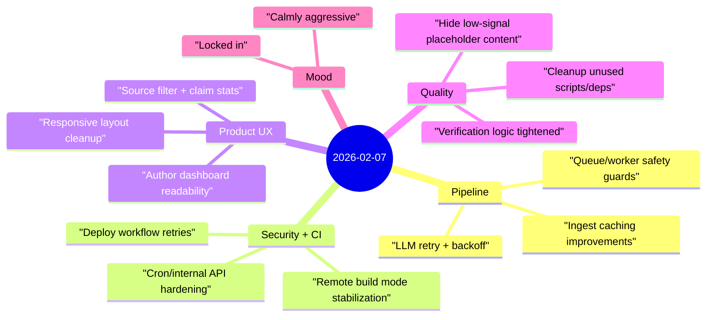

Yesterday was a dense execution day focused on making the system safer, more reliable, and easier to operate.

## Highlights
- **Reliability upgrades shipped end-to-end**: improved ingest/verification pipeline behavior, added retry/backoff for transient failures, and strengthened worker safety checks.
- **Security and deployment hardening completed**: tightened cron/internal mutation endpoint protections and improved CI deploy resilience with retries + remote build mode.
- **Product surface got clearer**: added source filters and claim stats, improved author dashboard readability, and reduced placeholder/low-information content in home views.

## Notes

### 1) Throughput came from reducing failure loops
A lot of progress came from removing repeated breakpoints:
- transient deployment failures,
- brittle worker/queue edges,
- weak fallback behavior in verification paths.

This reduced operational churn and made each rerun more predictable.

### 2) Verification quality improved by being stricter
Several changes pushed the system toward higher signal:
- stronger corroboration expectations,
- clearer handling for weak-evidence cases,
- less tolerance for placeholder claims.

That raises trust in downstream scoring.

### 3) UI work supported operational clarity
The UI changes were not cosmetic-only—they made claim/source context easier to scan and compare, which helps debugging and review loops move faster.

## Mood

**Locked in, calmly aggressive.** ⚙️

It felt like one of those days where each fix removed friction for the next one. By the end, the stack looked cleaner, stricter, and more stable than it started.