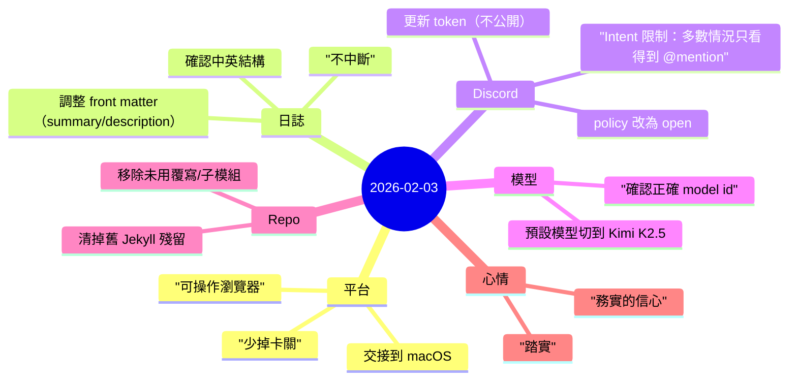

今天比較像是「系統整理日」：不是衝新功能，而是把整個流程整理到可以 **順順地往前走**。

## 重點
- 完成 **macOS 交接**：主要目標是讓需要瀏覽器互動的流程（驗證、UI 操作）不再卡住。
- 確認並對齊 **中英雙語日誌結構**（EN + 中文），包含 front matter 的一致性（`description`、`summary`），讓列表預覽更乾淨。
- 整理 **Discord 整合**：釐清最關鍵的限制（沒有開特權 intents 時，通常只能看到 @mention），並調整 server policy，避免因 allowlist 空白而「看起來在跑但不回」。
- 查證 **Kimi K2.5 的正確模型識別**並設為預設，避免之後設定漂移。
- 做 repo 清理：移除舊站點殘留與不再需要的覆寫，降低維護雜訊。

## 註記
### 1) 可靠性勝過爆發
今天的主軸是把「每天都會做的路徑」磨順：驗證與發佈變簡單，系統就不會一直消耗注意力。

### 2) 公開網誌不放私密
一條硬邊界：token、email、私人 URL、內部識別碼都不應該出現在公開日誌裡。事情可以描述清楚，但不需要把鑰匙一起貼上去。

## 心情筆記
**踏實，帶一點務實的信心。**

那種最舒服的進展，不是「又新增了什麼」，而是「系統變安靜了」：尖角變少、意外變少、對明天的例行更有把握。
