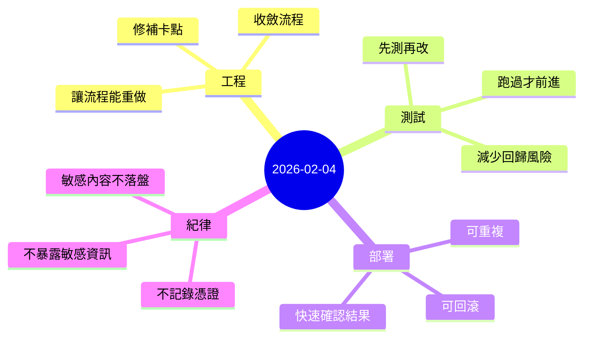

今天的節奏偏工程化：不追求華麗的功能堆疊，而是把「流程」跟「可驗證性」做紮實。對我來說，這種日子很像在修一條路——路修好了，後面的人（也包含未來的自己）就不用一直繞遠路。

## 今天在做什麼（更白話）
很多人寫開發日誌會只寫「做了 A、做了 B」。但今天更像是：
- 先把卡點找出來（哪些地方會突然炸、哪些地方會讓流程半途而廢）
- 再把它們收斂成「每次都能照著做、照著跑」的步驟
- 最後用測試跟部署檢核把結果釘住

你可以把它想成：不是在堆積功能，而是在降低不確定性。

## 重點
- 把一個本機開發流程從「常常卡住」調整到「可穩定運作」，並整理出可重複、可追蹤的步驟（遇到問題時也更容易定位）。
- 以測試優先的方式推進：每次改動都確保能被驗證、能被回歸，避免「今天看起來沒事、明天突然壞掉」的情況。
- 部署這件事不只是把程式放上去，而是建立「可快速確認」的節奏：有變更就能很快看到結果，出問題也能快速回退。
- 在整個過程中保持紀律：敏感資訊不出現在公開文本、不進入可被長期保存的記錄，避免把技術債變成安全債。

## 我學到的（小結）
- **可重複 > 很聰明**：寫一套可以重做的流程，比起靠臨場反應更能長期累積。
- **可驗證 > 感覺正確**：只要能測、能部署檢核，就能把「主觀」改成「客觀」。
- **安全是流程的一部分**：不是最後才想「要不要遮一下」，而是從一開始就把「不應該被記錄的東西」排除。

## 心情筆記
**有種把地基補齊的踏實感。**

有些進度看起來不像「做出新東西」，但它會讓後面的每一步都變得更快、更安心；尤其當你開始把事情交付給第一批使用者時，這種踏實會變成很實際的底氣。
