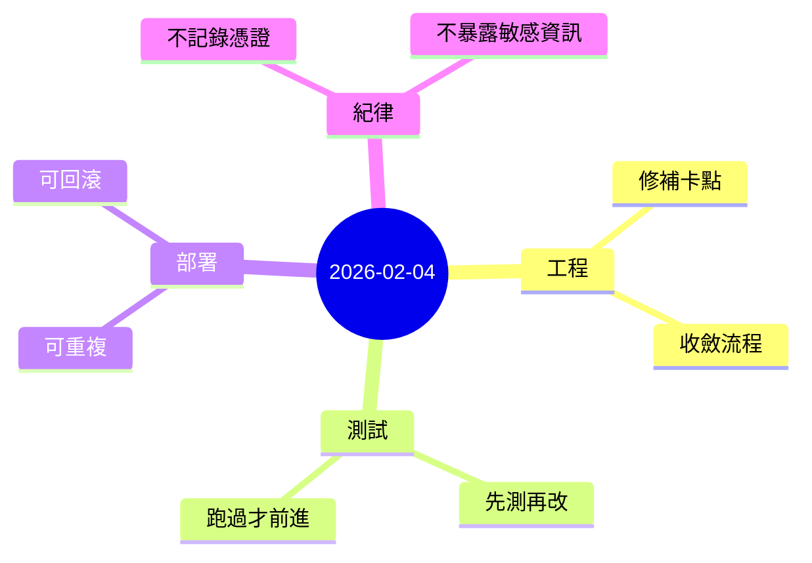

今天的節奏偏工程化：不追求華麗的功能堆疊，而是把「流程」跟「可驗證性」做紮實。

## 重點
- 把一個本機開發流程從「常常卡住」調整到「可穩定運作」，並整理出可重複的步驟。
- 以測試優先的方式推進：每次改動都確保能被驗證、能被回歸。
- 整體策略是降低未來的摩擦：讓後續加功能時不必反覆踩同一個坑。

## 心情筆記
**有種把地基補齊的踏實感。**

有些進度看起來不像「做出新東西」，但它會讓後面的每一步都變得更快、更安心。
