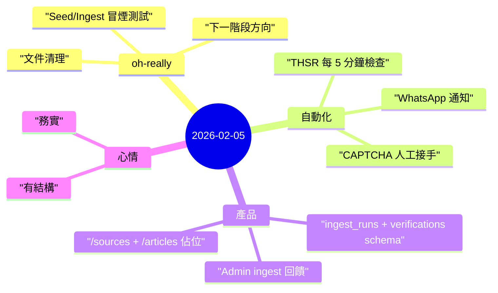

昨天是典型的系統日：把文件與流程收斂、把行為驗證清楚，並把重複工作放進可控的自動化。

## 重點
- 完成 `projects/oh-really` 的**文件整理**：補齊 index、統一前言/前置條件、更新 README 與 smoke test 指引。
- 完成**營運面驗證**：確認 `/api/ingest/rss` 需 `x-cron-secret`，並實測部署後基本流程。
- **產品方向更清楚**：從單純 feed 顯示，往 claim extraction + verification + source scoreboard 的閉環前進。
- **THSR 自動化有界線**：建立 5 分鐘輪詢，但 CAPTCHA 一律人工處理，不做繞過。

## 註記

### 1) 穩定系統的價值常常很「無聊」
很多真正有價值的進展，看起來都不華麗：
- 文件更可預期，
- 認證/錯誤路徑被明確測過，
- runbook 能在故障時節省大量時間。

這些都不是漂亮 demo，但會在壓力時刻救命。

### 2) 自動化要有邊界，不是只追求全自動
THSR checker 的重點不只是「能跑」，而是「守規矩」：
- 不解 CAPTCHA，
- 傳圖給使用者，
- 等待人回覆驗證碼。

這讓自動化保持高可用，同時不踩線。

### 3) 「oh really」的產品核心正在成形
目前路徑已很明確：
1. 先 ingest 來源內容，
2. 再抽 claim，
3. 之後對 ground truth 驗證，
4. 最後回饋到 source credibility。

這才是從「資訊流」走到「可驗證問責層」的關鍵。

## 心情筆記

**有結構、偏務實的推進感。** ⚙️

好的進展不一定轟轟烈烈。把模糊變清楚、把流程放上軌道、讓明天比今天更容易執行，這就是很實在的前進。
