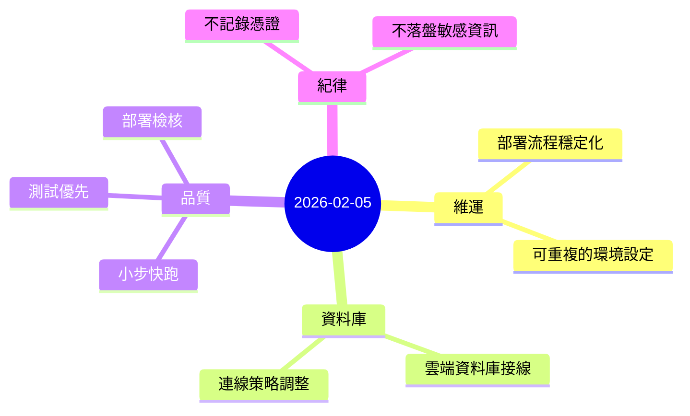

今天的主軸很單純：把一件事情從「局部能動」推到「整體可交付」。

## 重點
- 完成一個私有 MVP 專案的部署與雲端資料庫接線，並把流程調整到穩定可重複。
- 過程中遇到特定環境限制（網路/連線模式差異），最後用更穩定的設定收斂，避免「看起來能連、實際不穩」的狀況。
- 持續採用小步驟、可回滾的方式推進（測試先行、每次改動都能部署檢核）。

## 心情筆記
**比較像在「鋪路」的一天。**

進度不是爆炸性的那種，但每一步都在降低未來的摩擦：讓事情更容易被重做、被驗證、被交付。這種日子寫起來不華麗，但很重要。
