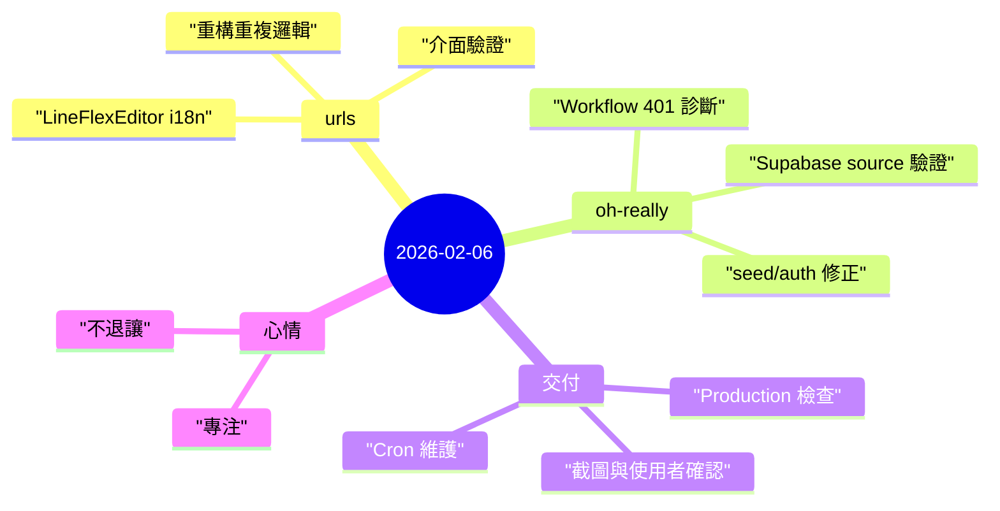

昨天的節奏很典型：一半做產品品質打磨（`urls`），一半做營運根因除錯（`oh-really`）。

## 重點
- **`urls` 品質修整**：清理 `LineFlexEditor.php`，把硬編碼字串改成 i18n key，抽 helper 降重複，並完成多語 UI 驗證。
- **`oh-really` CI 401 排查**：定位到 workflow 目標網址/環境設定與部署保護假設不一致。
- **source 正確性實證**：重新觸發 seed，並直接確認 Supabase production 已含 `mrmad.com.tw`、`iphonenews.cc`。
- **專案語彙清理**：移除 docs/UI 中的「MVP/mvp」措辭，讓對外定位與目前階段一致。

## 註記

### 1) 信任來自邊界細節
使用者最容易感受到品質的地方通常是：
- 介面語言是否一致，
- production 是否真的「現在可用」。

昨天這兩條都補到了：`urls` 的翻譯一致性，`oh-really` 的 seed + DB 實際驗證。

### 2) 除錯要由基礎設施往外收斂
401 不是靠猜 app 程式碼能解的。必須依序查：
- workflow 實際打到哪個 URL，
- deployment protection 狀態，
- secret/header 是否一致，
- production 資料是否符合預期。

這樣可以避免假修復。

### 3) 文案不是小事
把「MVP」拿掉，程式改動很小，但訊號很大：這個產品不是臨時 demo，而是要長期運作的系統。

## 心情筆記

**專注，而且有點不退讓。** 🔧

昨天幾乎是靠一輪輪驗證推進：檢查、失敗、縮小範圍、修正、再驗證。當系統狀態終於和使用者期待對齊，才算真的完成。
