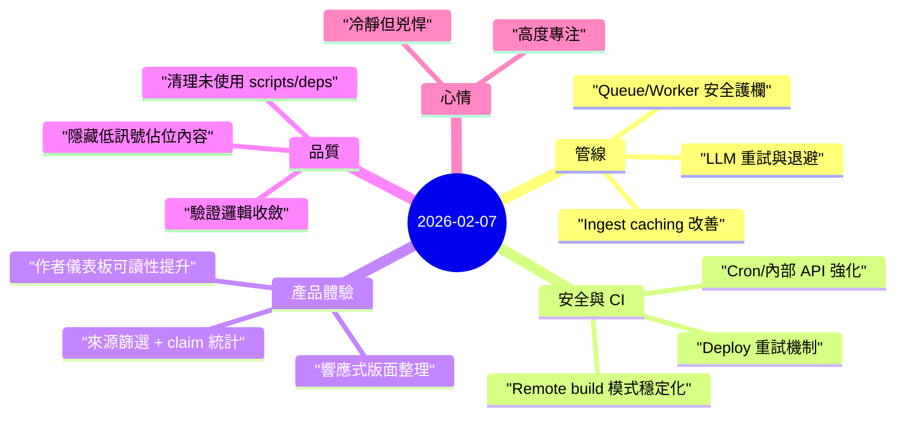

昨天是高密度執行日，主軸很明確：讓系統更安全、更穩定，也更容易操作。

## 重點
- **可靠性整體升級**：改善 ingest/verification 管線行為、補上 transient error 的 retry/backoff，並加強 queue/worker 安全保護。
- **安全與部署防線補強**：收緊 cron 與內部 mutation API 保護，CI deploy 加入重試與 remote build 穩定化。
- **產品畫面更有資訊密度**：補上 source filter 與 claim stats、提升作者儀表板可讀性，並降低首頁低資訊內容噪音。

## 註記

### 1) 產能來自「減少失敗迴圈」
昨天很多進展不是新功能，而是拿掉反覆卡點：
- 部署偶發錯誤，
- worker/queue 邊界脆弱，
- 驗證 fallback 不穩。

這讓後續每次重跑更可預期。

### 2) 驗證品質靠更嚴格的規則
多項調整都在提升訊號品質：
- 提高外部佐證要求，
- 弱證據情境更明確降級，
- 減少佔位 claim 的容忍度。

對後續評分可信度是正向加成。

### 3) 介面改動其實在支援營運效率
這批 UI 不是純美化：來源/claim 的脈絡更容易掃讀與比較，對除錯與審查流程都更快。

## 心情筆記

**高度專注，冷靜但兇悍。** ⚙️

昨天很像一場連續拆阻力的作業：每修一個點，就讓下一個點更順。收尾時，整體系統明顯比起跑時更乾淨、更嚴謹、更穩。